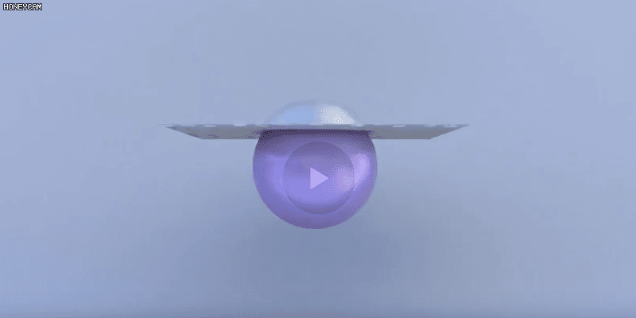
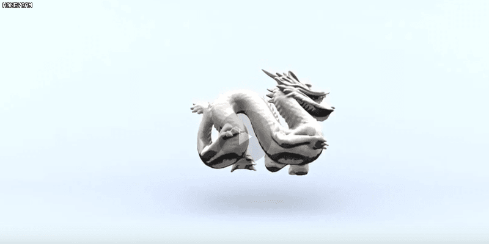
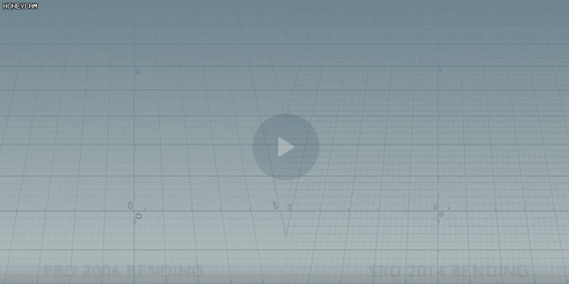
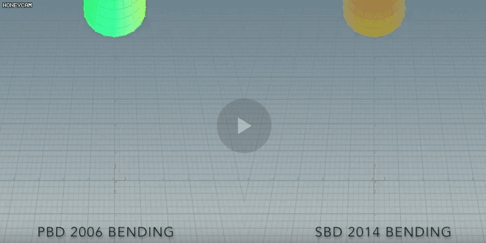

# PewBDie

A cloth simulation based on the paper [Position Based Dynamics written by Matthias Müller et al.](http://matthias-mueller-fischer.ch/publications/posBasedDyn.pdf). It is developed in CLion and rendered in Houdini. Partio and glm are used. Stretching constraint, fixed point constraint, collision constraint and bending constraint are implemented. Youtube link is [here](https://www.youtube.com/watch?v=25VKfM3vcTk
).

## A piece of cloth falls on a sphere

## A sphere pass through a piece of cloth

## A dragon falls on a plane

## Bending comparison between [Position Based Dynamics](http://matthias-mueller-fischer.ch/publications/posBasedDyn.pdf) and [Strain Based Dynamics](http://matthias-mueller-fischer.ch/publications/strainBasedDynamics.pdf)

